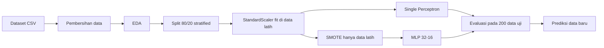

# Klasifikasi Pencemaran Air Laut akibat Limbah Industri Berbasis AI

[](https://colab.research.google.com/github/reinaldi997/REINALDI11/blob/main/tugas_kecil_ai.ipynb)


Proyek Tugas Kecil Kecerdasan Buatan yang membangun model jaringan saraf tiruan (*Multi-Layer Perceptron*) untuk mengklasifikasikan **tingkat pencemaran air** ke dalam tiga kelas (Bersih, Sedang, Berat) berdasarkan delapan parameter kualitas air, dengan konteks pencemaran perairan laut oleh limbah industri.

---

## Daftar Isi

1. [Ringkasan Proyek](#1-ringkasan-proyek)
2. [Latar Belakang dan Tujuan](#2-latar-belakang-dan-tujuan)
3. [Dataset](#3-dataset)
4. [Metodologi](#4-metodologi)
5. [Arsitektur Model](#5-arsitektur-model)
6. [Hasil Eksperimen](#6-hasil-eksperimen)
7. [Analisis dan Keterbatasan](#7-analisis-dan-keterbatasan)
8. [Struktur Repositori](#8-struktur-repositori)
9. [Instalasi dan Cara Menjalankan](#9-instalasi-dan-cara-menjalankan)
10. [Prediksi pada Data Baru](#10-prediksi-pada-data-baru)
11. [Reproduksibilitas](#11-reproduksibilitas)
12. [Rencana Pengembangan](#12-rencana-pengembangan)
13. [Referensi](#13-referensi)
14. [Kontribusi, Lisensi, dan Kontak](#14-kontribusi-lisensi-dan-kontak)

---

## 1. Ringkasan Proyek

| Aspek | Keterangan |
|---|---|
| **Masalah** | Klasifikasi multikelas tingkat pencemaran air |
| **Input** | 8 fitur numerik: pH, kekeruhan, suhu, DO, BOD, timbal, merkuri, arsenik |
| **Output** | `Pollution_Level`: 0 (Bersih), 1 (Sedang), 2 (Berat) |
| **Data** | 1.000 sampel, tanpa duplikat dan tanpa nilai kosong |
| **Model utama** | Multi-Layer Perceptron, 2 hidden layer (32 dan 16 neuron), aktivasi ReLU, optimizer Adam |
| **Model pembanding** | Single Perceptron (`class_weight='balanced'`) |
| **Penanganan data timpang** | SMOTE (`k_neighbors=2`) pada data latih, ditambah pembagian data *stratified* |
| **Hasil utama** | Akurasi uji MLP 92,00% vs Single Perceptron 71,50% (200 data uji) |
| **Lingkungan** | Google Colab atau Jupyter lokal, Python dengan scikit-learn dan imbalanced-learn |

> **Catatan penting membaca hasil:** 91,5% data bernilai kelas Berat, sehingga akurasi saja menyesatkan. Lihat [Bagian 6](#6-hasil-eksperimen) dan [Bagian 7](#7-analisis-dan-keterbatasan) untuk evaluasi per kelas.

---

## 2. Latar Belakang dan Tujuan

### 2.1 Latar Belakang

Limbah industri yang mengandung logam berat (misalnya timbal dan merkuri) dapat menurunkan kualitas perairan dan bersifat toksik bagi biota air. Penilaian mutu air secara konvensional, seperti *Water Quality Index* (WQI) dan STORET, dilakukan dengan perhitungan manual yang memakan waktu, sehingga diperlukan pendekatan otomatis berbasis pembelajaran mesin [1][3].

### 2.2 Rumusan Masalah

1.  Bagaimana mengklasifikasikan tingkat pencemaran dari parameter kualitas air?
2.	Bagaimana menangani data kelas yang sangat tidak seimbang?
3.	Seberapa baik jaringan saraf dibanding Single Perceptron?


### 2.3 Tujuan

1. Membangun model MLP untuk klasifikasi tiga tingkat pencemaran.
2. Menerapkan pembersihan data, standarisasi, dan SMOTE pada data latih.
3. Mengevaluasi model dengan akurasi, precision, recall, F1-score, dan *confusion matrix*.

### 2.4 Ruang Lingkup

- Termasuk: pembersihan data, EDA, pembagian data, standarisasi, SMOTE, pelatihan dua model, evaluasi, dan prediksi data baru.
- Tidak termasuk: *cross-validation*, *hyperparameter tuning*, penyimpanan model ke berkas, dan deployment.

---

## 3. Dataset

Berkas: `Water_Quality_Dataset.csv` (1.000 baris, 11 kolom).

### 3.1 Deskripsi Kolom

| Kolom | Tipe | Peran | Keterangan |
|---|---|---|---|
| `Timestamp` | datetime | Tidak dipakai model | Pengukuran per jam, 1 Januari 2024 s.d. 11 Februari 2024 |
| `Location` | kategori | Tidak dipakai model | Lima lokasi: L1 sampai L5 |
| `pH` | float | Fitur | Tingkat keasaman air (di notebook, rentang air bersih dicatat 6,5 sampai 8,5) |
| `Turbidity (NTU)` | float | Fitur | Kekeruhan air |
| `Temperature (°C)` | float | Fitur | Suhu air |
| `DO (mg/L)` | float | Fitur | *Dissolved Oxygen*, oksigen terlarut |
| `BOD (mg/L)` | float | Fitur | *Biochemical Oxygen Demand*, kebutuhan oksigen biokimia |
| `Lead (mg/L)` | float | Fitur | Kadar timbal (Pb) |
| `Mercury (mg/L)` | float | Fitur | Kadar merkuri (Hg) |
| `Arsenic (mg/L)` | float | Fitur | Kadar arsenik (As) |
| `Pollution_Level` | int | **Target** | 0 = Bersih, 1 = Sedang, 2 = Berat |

### 3.2 Statistik Ringkas

Setelah pembersihan (keluaran notebook):

| Fitur | Min | Rata-rata | Maks |
|---|---|---|---|
| pH | 5,516 | 7,251 | 8,998 |
| Turbidity (NTU) | 0,503 | 10,219 | 19,967 |
| Temperature (°C) | 15,000 | 24,967 | 34,991 |
| DO (mg/L) | 2,000 | 5,929 | 9,982 |
| BOD (mg/L) | 1,008 | 5,483 | 9,994 |
| Lead (mg/L) | 0,000128 | 0,009965 | 0,019989 |
| Mercury (mg/L) | 0,000010 | 0,000981 | 0,001998 |
| Arsenic (mg/L) | 0,000505 | 0,009855 | 0,019922 |

### 3.3 Distribusi Kelas

| Kelas | Label | Jumlah | Proporsi |
|---|---|---|---|
| 0 | Bersih | 6 | 0,6% |
| 1 | Sedang | 79 | 7,9% |
| 2 | Berat | 915 | 91,5% |

Dataset **sangat tidak seimbang**. Menebak kelas Berat untuk seluruh sampel sudah menghasilkan akurasi sekitar 91,5%.

### 3.4 Rata-rata Fitur per Kelas

| Fitur | Kelas 0 (Bersih) | Kelas 1 (Sedang) | Kelas 2 (Berat) |
|---|---|---|---|
| pH | 7,67 | 7,29 | 7,24 |
| Turbidity (NTU) | 2,74 | 5,30 | 10,69 |
| Temperature (°C) | 21,64 | 25,57 | 24,94 |
| DO (mg/L) | 7,91 | 6,68 | 5,85 |
| BOD (mg/L) | 2,06 | 3,64 | 5,66 |
| Lead (mg/L) | 0,0052 | 0,0076 | 0,0102 |
| Mercury (mg/L) | 0,0006 | 0,0008 | 0,0010 |
| Arsenic (mg/L) | 0,0060 | 0,0077 | 0,0101 |

Semakin tinggi tingkat pencemaran, kekeruhan, BOD, dan kadar logam berat cenderung naik, sedangkan DO turun. Pola ini konsisten dengan teori pencemaran perairan. Kelas Bersih hanya 6 sampel, sehingga rata-ratanya kurang kuat sebagai dasar kesimpulan.


---

## 4. Metodologi

### 4.1 Alur Kerja



### 4.2 Tahapan Rinci

| No | Tahap | Detail implementasi | Alasan |
|---|---|---|---|
| 1 | Pembersihan data | Hapus duplikat; ubah fitur ke numerik dengan `pd.to_numeric(errors='coerce')`; isi nilai kosong dengan median; filter `0 <= pH <= 14` | Menjamin data valid dan lengkap. Pada dataset ini ditemukan 0 duplikat dan 0 nilai kosong |
| 2 | EDA | `describe()`, `value_counts()` pada target, diagram batang distribusi kelas, boxplot kekeruhan per kelas | Memahami skala fitur dan ketidakseimbangan kelas |
| 3 | Pembagian data | `train_test_split(test_size=0.2, random_state=42, stratify=y)` menghasilkan 800 latih dan 200 uji | `stratify` menjaga proporsi kelas di kedua bagian |
| 4 | Standarisasi | `StandardScaler`, `fit_transform` pada data latih, `transform` pada data uji | Skala fitur sangat berbeda (suhu puluhan, merkuri sekitar 0,001); fit hanya pada data latih mencegah kebocoran data |
| 5 | Penyeimbangan kelas | `SMOTE(random_state=42, k_neighbors=2)` hanya pada data latih | Membuat sampel sintetis kelas minoritas. `k_neighbors` kecil karena kelas Bersih di data latih hanya sekitar 5 sampel |
| 6 | Pelatihan | Single Perceptron pada data latih terstandarisasi; MLP pada data hasil SMOTE | Membandingkan model linear sederhana dengan jaringan non-linear |
| 7 | Evaluasi | `accuracy_score`, `classification_report`, `confusion_matrix` (heatmap) pada data uji | Menilai performa global dan per kelas |

### 4.3 Metrik Evaluasi

- **Precision**: dari semua prediksi kelas X, berapa yang benar-benar kelas X.
- **Recall**: dari semua sampel asli kelas X, berapa yang berhasil ditemukan.
- **F1-score**: rata-rata harmonik precision dan recall.
- **Macro average**: rata-rata metrik tiap kelas dengan bobot sama (sensitif terhadap kelas minoritas).
- **Weighted average**: rata-rata berbobot jumlah sampel (didominasi kelas Berat).

---

## 5. Arsitektur Model

### 5.1 Multi-Layer Perceptron (model utama)

```
Input (8)  ──►  Dense 32 (ReLU)  ──►  Dense 16 (ReLU)  ──►  Output 3 (probabilitas kelas)
```

| Parameter | Nilai |
|---|---|
| Kelas | `sklearn.neural_network.MLPClassifier` |
| `hidden_layer_sizes` | `(32, 16)` |
| `activation` | `'relu'` |
| `solver` | `'adam'` |
| `max_iter` | `1000` |
| `random_state` | `42` |
| Data latih | Hasil SMOTE (terstandarisasi) |

Jumlah parameter yang dipelajari: (8×32+32) + (32×16+16) + (16×3+3) = 288 + 528 + 51 = **867 parameter**.

### 5.2 Single Perceptron (pembanding)

| Parameter | Nilai |
|---|---|
| Kelas | `sklearn.linear_model.Perceptron` |
| `max_iter` | `1000` |
| `class_weight` | `'balanced'` |
| `random_state` | `42` |
| Data latih | Terstandarisasi, **tanpa** SMOTE |

> Kedua model memakai penanganan ketidakseimbangan yang berbeda (bobot kelas vs SMOTE), sehingga perbandingannya bersifat indikatif, bukan eksperimen terkontrol penuh.

---

## 6. Hasil Eksperimen

Evaluasi pada 200 data uji (1 sampel kelas Bersih, 16 Sedang, 183 Berat).

### 6.1 Perbandingan Model

| Model | Akurasi | Macro F1 | Weighted F1 |
|---|---|---|---|
| Single Perceptron | 71,50% | 0,35 | 0,80 |
| **MLP (32-16)** | **92,00%** | **0,63** | **0,92** |
| *Baseline: selalu menebak kelas Berat* | *91,50%* | – | – |

### 6.2 Laporan Klasifikasi MLP

| Kelas | Precision | Recall | F1-score | Support |
|---|---|---|---|---|
| 0 (Bersih) | 0,33 | 1,00 | 0,50 | 1 |
| 1 (Sedang) | 0,50 | 0,38 | 0,43 | 16 |
| 2 (Berat) | 0,96 | 0,97 | 0,96 | 183 |
| Macro avg | 0,60 | 0,78 | 0,63 | 200 |
| Weighted avg | 0,92 | 0,92 | 0,92 | 200 |

### 6.3 Laporan Klasifikasi Single Perceptron

| Kelas | Precision | Recall | F1-score | Support |
|---|---|---|---|---|
| 0 (Bersih) | 0,02 | 1,00 | 0,04 | 1 |
| 1 (Sedang) | 0,14 | 0,12 | 0,13 | 16 |
| 2 (Berat) | 0,99 | 0,77 | 0,86 | 183 |
| Macro avg | 0,39 | 0,63 | 0,35 | 200 |
| Weighted avg | 0,92 | 0,71 | 0,80 | 200 |

*Confusion matrix* MLP ditampilkan sebagai heatmap oleh notebook (sel Evaluasi Model).

---

## 7. Analisis dan Keterbatasan

### 7.1 Temuan Utama

- MLP unggul jauh dibanding Single Perceptron (92,00% vs 71,50%), selaras dengan studi yang menemukan ANN memberi akurasi tertinggi di antara beberapa algoritma klasifikasi kualitas air [2].
- Kelas Berat terdeteksi sangat baik (recall 0,97, F1 0,96), penting untuk deteksi dini pencemaran.
- SMOTE dan standarisasi membantu model mempelajari kelas minoritas (macro recall 0,78).

### 7.2 Keterbatasan

| Keterbatasan | Dampak |
|---|---|
| Akurasi 92,00% hanya sedikit di atas baseline 91,50% | Akurasi tidak boleh dibaca sendirian; gunakan metrik per kelas |
| Kelas Bersih hanya 1 sampel uji | Precision 0,33 dan recall 1,00 tidak stabil secara statistik |
| Recall kelas Sedang hanya 0,38 | Banyak air tercemar sedang salah diklasifikasikan |
| Satu kali pembagian data, tanpa *cross-validation* | Hasil dapat berubah bila pembagian data berbeda |
| Tanpa *hyperparameter tuning* | Arsitektur belum dioptimalkan |
| Perlakuan ketidakseimbangan berbeda antar model | Perbandingan bersifat indikatif |
| Sumber dataset belum terdokumentasi | Belum dapat diklaim sebagai data pengukuran laut nyata |

### 7.3 Catatan Implementasi Notebook

- Sel pelatihan (sel 9) melatih `mlp_model` dua kali; definisi kedua menimpa yang pertama, dengan hasil akhir sama. Definisi pertama dapat dihapus.
- Sel unggah berkas memakai `google.colab.files.upload()`, sehingga hanya berjalan di Google Colab. Untuk Jupyter lokal, lihat [Bagian 9.2](#92-jupyter-lokal).
- Bila `uploaded` tidak ada, notebook membaca berkas bernama `Water_Quality_Dataset (2).csv`. Nama ini sesuai hasil unggahan ulang di Colab dan perlu disesuaikan saat dijalankan di tempat lain.

---

## 8. Struktur Repositori

```
.
├── README.md                    # Dokumentasi proyek (berkas ini)
├── tugas_kecil_ai.ipynb         # Notebook utama (Google Colab / Jupyter)
└── Water_Quality_Dataset.csv    # Dataset kualitas air (1.000 baris)
```

Direkomendasikan menambahkan `requirements.txt` (isi di [Bagian 9.2](#92-jupyter-lokal)) dan berkas `LICENSE`.

---

## 9. Instalasi dan Cara Menjalankan

### 9.1 Google Colab (paling mudah)

1. Klik tombol **Open In Colab** di bagian atas README ini.
2. Jalankan sel secara berurutan dari atas.
3. Saat sel unggah berkas muncul, pilih `Water_Quality_Dataset.csv` dari komputer.
4. Jalankan sel sisanya sampai tahap prediksi.

Notebook ini sudah berjalan di Colab tanpa instalasi tambahan. Bila muncul `ModuleNotFoundError` untuk `imblearn`, jalankan `!pip install imbalanced-learn` di sel baru.

### 9.2 Jupyter Lokal

**Prasyarat:** Python 3.9 atau lebih baru.

```bash
# 1. Salin repositori dan masuk ke folder
git clone <url-repositori>
cd <nama-folder>

# 2. Buat dan aktifkan virtual environment
python -m venv venv
source venv/bin/activate        # Windows: venv\Scripts\activate

# 3. Pasang dependensi
pip install -r requirements.txt

# 4. Jalankan Jupyter
jupyter notebook tugas_kecil_ai.ipynb
```

Isi `requirements.txt` yang disarankan:

```
pandas>=1.3.0
numpy>=1.21.0
scikit-learn>=1.0.0
imbalanced-learn>=0.9.0
matplotlib>=3.4.0
seaborn>=0.11.0
jupyter>=1.0.0
```

**Penyesuaian untuk lokal:** ganti sel unggah berkas dan bagian pembacaan data. Hapus `from google.colab import files` dan `files.upload()`, lalu di sel pembersihan data gunakan:

```python
df = pd.read_csv('Water_Quality_Dataset.csv')
```

### 9.3 Urutan Sel Notebook

| Sel | Isi |
|---|---|
| 1 | Import pandas, numpy, `train_test_split`, `StandardScaler` |
| 2 | Unggah dataset (Colab) |
| 3 | Pembersihan data |
| 5 | EDA dan visualisasi |
| 6 | Pembagian data dan standarisasi |
| 7 | Import model dan SMOTE |
| 8 | Penerapan SMOTE |
| 9 | Pelatihan Single Perceptron dan MLP |
| 10 | Import metrik dan visualisasi |
| 11 | Evaluasi model dan *confusion matrix* |
| 12 | Prediksi data baru |

---

## 10. Prediksi pada Data Baru

Setelah seluruh sel sebelumnya dijalankan (agar `scaler`, `mlp_model`, dan `feature_cols` tersedia), isi nilai parameter di sel prediksi:

```python
ph_input = 7.5          # Derajat keasaman
turbidity_input = 1.2   # Kekeruhan (NTU)
temp_input = 22.0       # Suhu (°C)
do_input = 8.2          # Oksigen terlarut (mg/L)
bod_input = 1.8         # BOD (mg/L)
lead_input = 0.0001     # Timbal (mg/L)
mercury_input = 0.0002  # Merkuri (mg/L)
arsenic_input = 0.0002  # Arsenik (mg/L)

data_baru = pd.DataFrame([[
    ph_input, turbidity_input, temp_input,
    do_input, bod_input, lead_input,
    mercury_input, arsenic_input
]], columns=feature_cols)

data_baru_scaled = scaler.transform(data_baru)   # wajib memakai scaler yang sama
prediksi = mlp_model.predict(data_baru_scaled)[0]
```

| Kelas | Keterangan yang ditampilkan |
|---|---|
| 0 | Air Bersih / Layak Digunakan |
| 1 | Tercemar Ringan - Sedang |
| 2 | Tercemar Berat / Tidak Layak Digunakan |

Contoh di atas menghasilkan **Kelas 0 (Air Bersih)**. Urutan kolom input harus sama persis dengan `feature_cols`.

---

## 11. Reproduksibilitas

- `random_state=42` dipakai pada `train_test_split`, `SMOTE`, `Perceptron`, dan `MLPClassifier`.
- Hasil yang tercantum di README ini berasal dari keluaran tersimpan pada notebook. Perbedaan kecil dapat muncul bila versi `scikit-learn` atau `imbalanced-learn` berbeda.
- Untuk hasil yang persis sama, catat versi paket dengan `pip freeze > requirements-lock.txt`.

---

## 12. Rencana Pengembangan

Belum diimplementasikan, disusun sebagai arah perbaikan:

- [ ] Menambah data kelas Bersih dan Sedang.
- [ ] Menerapkan *stratified k-fold cross-validation* [1].
- [ ] *Hyperparameter tuning* MLP (jumlah neuron, jumlah layer, regularisasi `alpha`, *early stopping*).
- [ ] Membandingkan dengan Random Forest, Gradient Boosting, atau XGBoost.
- [ ] Menyamakan perlakuan ketidakseimbangan antar model agar perbandingan lebih adil.
- [ ] Menambah metrik yang peka kelas minoritas (misalnya *balanced accuracy* dan PR-AUC).
- [ ] Menyimpan model dan scaler (misalnya dengan `joblib`) agar prediksi tidak perlu melatih ulang.
- [ ] Menguji pada data pengukuran air laut yang terdokumentasi sumbernya.

---

## 13. Referensi

[1] Pritalia, G. L. (2022). Analisis Komparatif Algoritme Machine Learning dan Penanganan Imbalanced Data pada Klasifikasi Kualitas Air Layak Minum. *KONSTELASI: Konvergensi Teknologi dan Sistem Informasi*, 2(1), 43–55. https://doi.org/10.24002/konstelasi.v2i1.5630

[2] Hartanti, D., & Pradana, A. I. (2023). Komparasi Algoritma Machine Learning dalam Identifikasi Kualitas Air. *SMARTICS Journal*, 9(1), 1–6. https://doi.org/10.21067/smartics.v9i1.8113

[3] Sulistyo, A. A. H., Suprijanto, J., & Yulianto, B. (2024). Analisis Kualitas Air dan Kandungan Logam Berat Timbal (Pb) pada Air Laut di Perairan Pelabuhan Tanjung Emas Kota Semarang Jawa Tengah. *Journal of Marine Research*, 13(1), 108–114. https://doi.org/10.14710/jmr.v13i1.38751

Dokumentasi pustaka: [scikit-learn](https://scikit-learn.org/), [imbalanced-learn](https://imbalanced-learn.org/), [pandas](https://pandas.pydata.org/).

---

## 14. Kontribusi, Lisensi, dan Kontak

### Kontribusi

1. *Fork* repositori.
2. Buat branch fitur: `git checkout -b feature/NamaFitur`
3. *Commit* perubahan: `git commit -m "Tambah fitur"`
4. *Push* ke branch: `git push origin feature/NamaFitur`
5. Buka *Pull Request*.

### Lisensi

MIT License. Tambahkan berkas `LICENSE` di root repositori agar lisensi berlaku secara formal.

### Kontak

Email: raihanalrajab108l@gmail.com

---

**Status:** Tugas kecil, dalam pengembangan · **Terakhir diperbarui:** 30 September 2026
